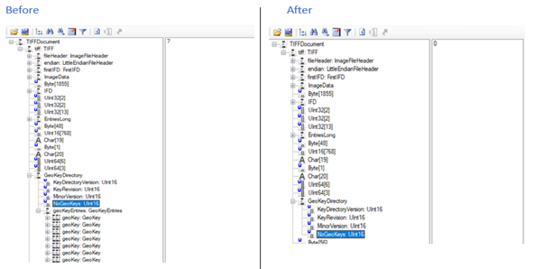
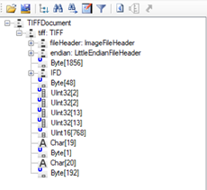

# Overview
GeoTiff is a metadata standard for embedding georeferencing information within a tiff image. The georeferencing 
information is inserted in a file using tiff tags that contain spatial data such as map projections, coordinate systems 
etc.

The geocoding coordinate system is defined by the **GeoKeyDirectoryTag** (which contains several GeoKey entries), while the 
Georeferencing information is determined by the **ModelTiepointTag** and the **ModelPixelScale**, or **ModelTransformationTag**.
Glasswall provides the ability to remove GeoTiff tags via a policy configuration file or block a file containing 
specified geotags. A blanket ‘setting’ can be applied to remove all georeferencing information, or individual tag/geo 
key IDs can be listed to remove specific tags. See example section below.

## Configuration
### GeoTiff policy file Snippet
See below an example of the GeoTiff configuration policy file.

```
<tiffConfig>
    
    <geotiff>sanitise</geotiff>
        
    <geotiff_allowlist>                 
        <geokey_id>3072</geokey_id>
        <geokey_id>3073</geokey_id>			
    </geotiff_allowlist>
        
    <geotiff_denylist>		
        <geokey_id>2049</geokey_id> 
    </geotiff_denylist>
        
    <geotiff_requiredlist>
        <geokey_id>1024</geokey_id>
        <geokey_id>1025</geokey_id>
        <geokey_id>1026</geokey_id>
    </geotiff_requiredlist>
        
</tiffConfig>
```

### Description
#### Global (Blanket) Setting
```
<tiffConfig>    
    <geotiff>sanitise</geotiff>
    ...
```
This is the parent geotiff setting. If set to **allow** or **disallow** the policy lists (**allowlist**, **denylist**, 
**requiredlist**) do not come into effect. If set to **allow** all tags are left intact in the regenerated file. 
If set to **disallow** the file is blocked and will not be regenerated if geotiff content is present.
If set to **sanitise** tags outside of the policy lists (**allowlist**, 
**denylist**, **requiredlist**) are removed.

#### Allow List
```
...
    <geotiff_allowlist>                 
        <geokey_id>3072</geokey_id>
        <geokey_id>3073</geokey_id>			
    </geotiff_allowlist>
...

```

Geo keys in the **allowlist** will be preserved and will therefore be present in the regenerated file.

#### Deny List
```
...
    <geotiff_denylist>		
        <geokey_id>2049</geokey_id> 
    </geotiff_denylist>
...

```

If any geo keys in the **denylist** are present in the file during processing, the file will be blocked and will not be 
regenerated

#### Required List

```
...
    <geotiff_requiredlist>
        <geokey_id>1024</geokey_id>
        <geokey_id>1025</geokey_id>
        <geokey_id>1026</geokey_id>
    </geotiff_requiredlist>
</tiffConfig>

```

One or more of the geo keys in the **requiredlist** must be present in the file. If no required keys are present in the 
file, the file will be blocked and will not be regenerated. 

Example of geo keys can be found [here](https://exiftool.org/TagNames/GeoTiff.html) 

Where,
```
    geokey_id == tag ID

```

## Examples
### Example 1
In the example below, we have carried out two separate runs on the same file. In Figure 1, the policy settings were 
configured only to remove geo key entries specified by the geo key ID. In Figure 2, the file was processed with the 
configuration to remove all georeferencing information.

#### Figure 1
The image below shows geo tiff structure trees for a file before and after processing, where all geo keys have been set 
for removal (by listing each geo key entry ID in the policy file).

.

#### Figure 2
The image below shows a geo tiff structure tree for a file after processing with a blanket setting applied to remove all 
georeferencing information.

.
