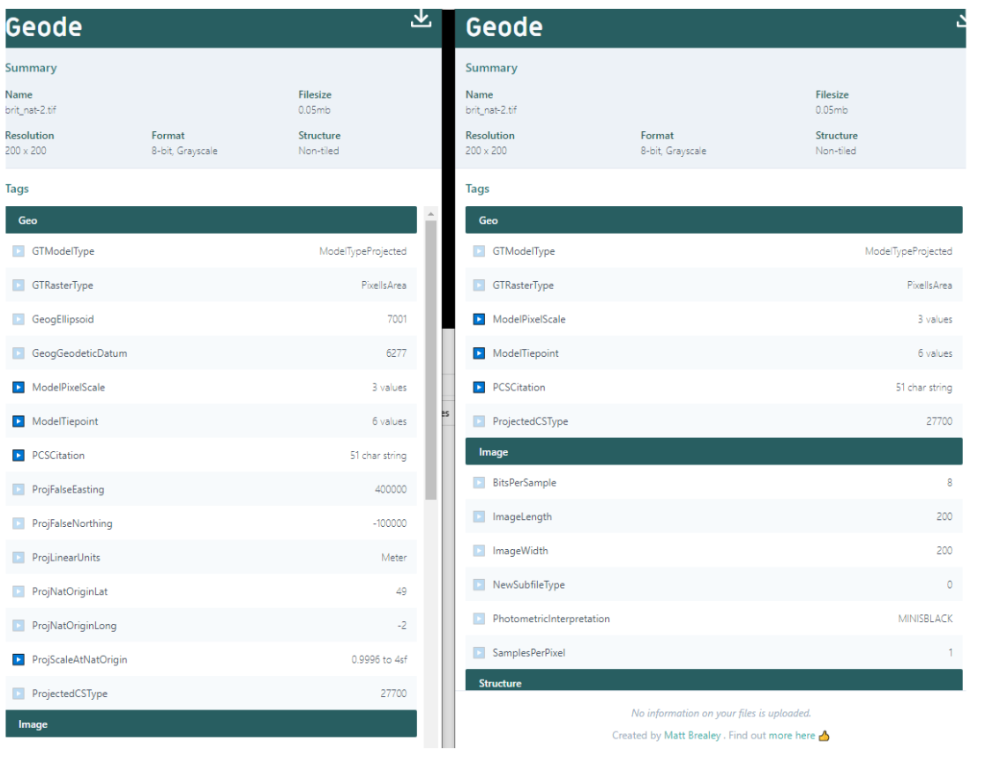

# Test Data
## GeoTiff
### Test sets
- Set 000: Contains randomly selected GeoTiff test files.
- Set 001: TBD

### Verifying results
The [Geode] (https://www.mattbrealey.com/geode/) tool can be used to compare files pre and post processing.

Simply drag and drop the file into the window to view information (metadata) of the file.
#### Example

See image below. The results for the original file are shown on the left, and the results for the regenerated file are 
shown on the right.

The regenerated file has less Geo metadata as it has been removed via policy during the regeneration process. 
